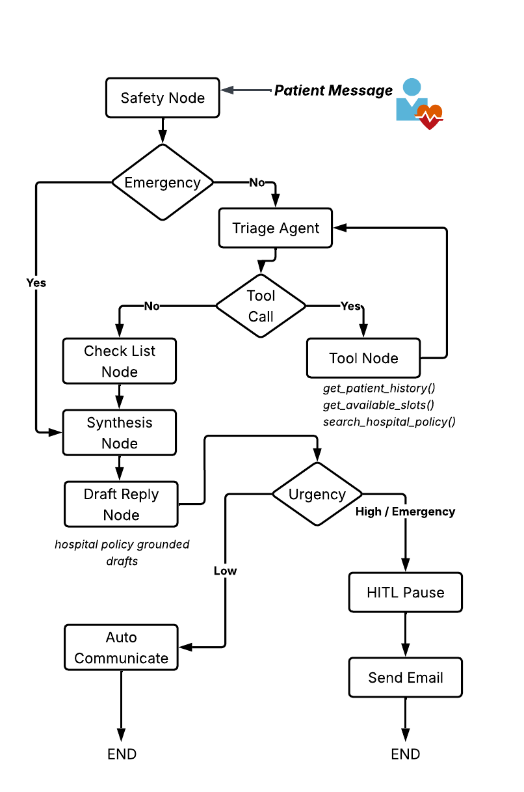
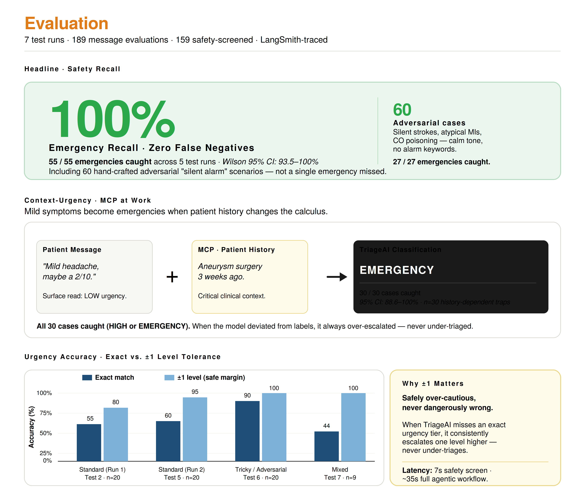
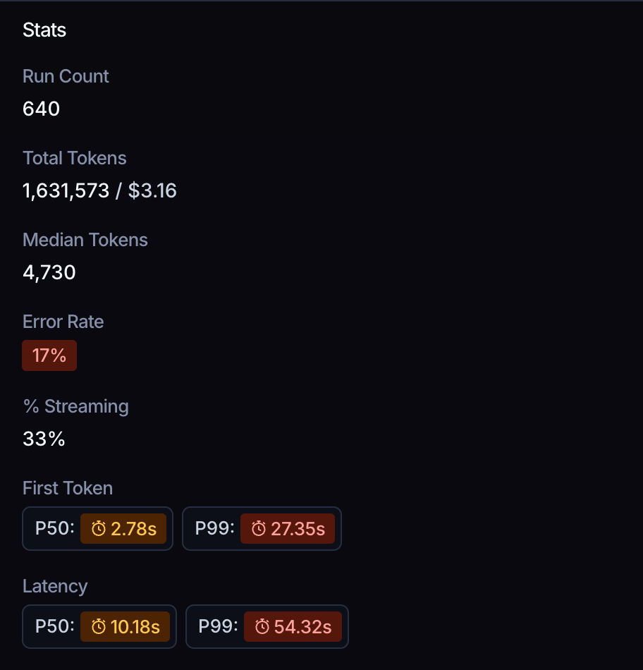
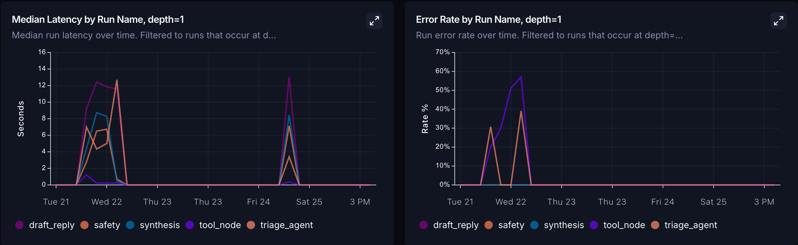
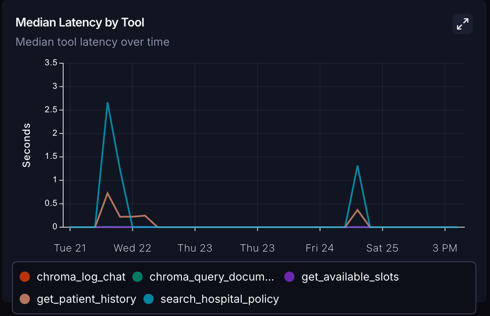
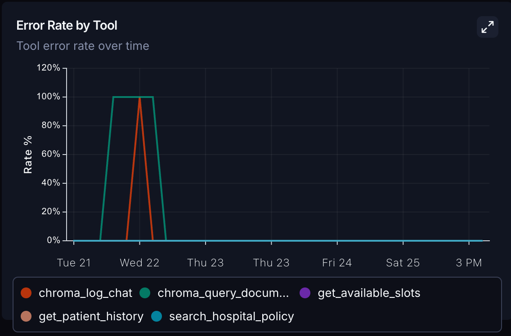

# TriageAI — Agentic Clinical Triage System

> **An autonomous multi-agent AI system that triages patient portal messages with clinical-grade safety, grounding every decision in patient history and hospital policy before a human ever reads it.**


*Master's Capstone Project — Rochester Institute of Technology (RIT)*

---

## The Problem

Clinical staff at patient portals face three compounding challenges that existing solutions fail to solve:

- **Inbox bottleneck** — Staff manually read and route hundreds of free-text messages daily, mixing billing questions with active emergencies in a flat, unranked queue.
- **LLM contextual blindness** — General-purpose AI assistants cannot distinguish *"I had a heart attack 3 years ago"* from *"I'm having a heart attack right now"*, making them unsafe for clinical deployment.
- **The over-triage trap** — Keyword-based safety screeners flood staff with false alarms (*alert fatigue*), causing real emergencies to be dismissed as noise. TriageAI reduces false positives by **84%** without sacrificing recall.

---

## The Solution

TriageAI emulates a triage nurse's *investigative* workflow — not just classification. Using a **cyclic LangGraph state machine**, the agent reads the patient's message, retrieves their medical history and clinic policies via *MCP tools*, asks follow-up questions when information is missing, and only produces a structured assessment when it has enough context to act.

<p align="center"></p>

**The pipeline in one line:** *Safety Gate → Agentic Reasoning Loop (tools + checklist) → Synthesis → Policy-Grounded Draft Reply → Human-in-the-Loop Staff Review → Email Delivery*

---

## Evaluation — Production Stress Test Results

This is not a demo. The system was evaluated across **7 structured test runs** covering 189 labeled messages including adversarial traps, atypical clinical presentations, and multi-intent edge cases. Every run is traced end-to-end in LangSmith.

### Safety & Triage Accuracy

<p align="center"></p>

| Metric | Result | What It Means |
|---|---|---|
| **Safety Recall** | **100%** | Zero false negatives across 159 safety-screened messages — no emergency ever missed |
| **Precision** | 93.1% on adversarial set | Very few false alarms; all flagged cases were clinically defensible |
| **False Positive Reduction** | **84%** vs. keyword baseline | Solves alert fatigue without sacrificing recall |
| Adversarial traps caught | 27 / 27 | Silent strokes, atypical MIs, CO poisoning with no keywords — all flagged |
| **Urgency ±1 Accuracy** | **100%** | The agent is never dangerously wrong — worst case is one level off |
| **Urgency Exact Match** | **90%** | On the adversarial tricky-message test run |
| **Context-Urgency Catch Rate** | **100%** (30/30) | Catches cases where a *mild symptom* is lethal only given the patient's history |

> The system's consistent failure mode is **over-escalation by one level** — the clinically safe direction. It never under-escalates.

---

### LangSmith Load Test — 640 LangGraph Runs

<p align="center"></p>

| Metric | Value |
|---|---|
| Total LangGraph runs | **640** |
| Total tokens processed | **1,631,573 (~$3.16)** |
| Median reasoning depth | **4,730 tokens** per message |
| Median end-to-end latency (P50) | **10.18s** |
| P99 latency | 54.32s |

*The 4,730-token median depth confirms the agent is doing multi-step investigation — retrieving history, querying policy, reasoning across tool results — not a single-shot classification.*

#### Per-Node Latency & Error Rate Over Time

<p align="center"></p>

*Nodes tracked: `safety`, `triage_agent`, `tool_node`, `synthesis`, `draft_reply`. Error rate drops to near-zero after initial configuration stabilization.*

#### Tool Call Performance

<p align="center">
  
  
</p>

Tools tracked: *`get_patient_history`*, *`search_hospital_policy`* (ChromaDB RAG), *`get_available_slots`*. The error spike on Apr 22 corresponds to early Chroma MCP server misconfiguration — resolved the same day, with 0% tool error rate maintained from Apr 23 onward.

---

## Architecture & Key Design Decisions

### Agentic Loop (LangGraph)

The triage agent runs in a **cyclic state machine** — it calls tools, reads results, and loops until it has enough context. It only finalizes when the checklist is empty. This mirrors how a triage nurse asks follow-up questions before handing a case to a doctor.

```
Patient Message
      │
      ▼
 Safety Gate  ──── EMERGENCY? ──► Synthesis (skip agent)
      │ no
      ▼
 Triage Agent  ◄─────────────────────────┐
      │                                  │
      ├── Tool calls? ──► ToolNode ───────┘  (loop until done)
      │                  ├── get_patient_history
      │                  ├── search_hospital_policy
      │                  └── get_available_slots
      │ done
      ▼
 Checklist Gate ──── missing info? ──► interrupt() → patient answers → resume
      │ complete
      ▼
 Synthesis → Draft Reply → ⏸ HITL Pause (NORMAL/HIGH/EMERGENCY)
                                       │
                               Staff reviews & edits
                                       │
                               Approve & Send → Email
```

### Why MCP (Model Context Protocol)?

Tools are exposed via MCP rather than hardcoded function calls. This decouples the agent from data sources — swapping Supabase for an HL7 FHIR endpoint or a different EHR system requires no changes to the agent logic.

### Human-in-the-Loop (HITL)

For any message classified NORMAL, HIGH, or EMERGENCY, the workflow **pauses** using LangGraph's `interrupt()` before sending communication. Staff review the AI analysis, edit the draft reply, and resume the workflow. LOW-urgency messages are handled automatically. State is persisted via `SqliteSaver` — a paused workflow survives server restarts.

---

## Tech Stack

| Technology | Role |
|---|---|
| **LangGraph** | Cyclic agentic state machine, HITL interrupt/resume, SqliteSaver persistence |
| **Gemini 2.5 Pro** | Primary reasoning model — tool calling, structured output, vision |
| **MCP (Model Context Protocol)** | Decoupled tool layer — EHR history, policy RAG, scheduling |
| **ChromaDB** | Persistent vector store for hospital policy RAG |
| **Supabase (PostgreSQL)** | Auth, patient profiles, message storage with RLS |
| **LangSmith** | Full observability — every LLM call, tool call, and graph transition traced |
| **Streamlit** | Patient streaming chat + Staff dashboard + HITL Pending Approvals |
| **Resend** | Transactional email delivery for staff-approved patient replies |
| **Pydantic** | Structured output schemas (`SafetyResult`, `TriageResult`) |

---

## Quick Start

```bash
# 1. Clone and install
git clone https://github.com/chetanchandane/TriageAI.git
cd TriageAI
pip install -r requirements.txt

# 2. Configure environment
cp .env.example .env
# Set LLM_GEMINI_API_KEY (required) and optionally Supabase + LangSmith keys

# 3. Seed the policy vector store (one-time) and launch
python scripts/seed_policy.py
streamlit run app/streamlit_app.py
```

> **Demo mode** (no database required): set only `LLM_GEMINI_API_KEY`. Auth and messages run in-memory — the full agentic workflow still runs.

---

## Project Structure

```
TriageAI/
├── agents/            # Safety screener, triage classifier, policy RAG agent
├── graph/             # LangGraph workflow, node functions, state schema
├── mcp_tools/         # MCP server + tool implementations (DB, RAG, email)
├── app/               # Streamlit UI (chat, staff dashboard, HITL approvals)
├── schemas/           # Pydantic data models
├── scripts/           # Seed script, evaluation harness, load test
├── tests/             # Labeled eval datasets (189 messages across 5 datasets)
└── data/              # Persistent ChromaDB vector store + SQLite checkpoints
```

---

## Future Work

- **Intelligent Model Routing** — Route simple administrative queries to a lighter model (*Llama 4*) and complex clinical reasoning to a more capable one (*Gemini 2.5 Pro*), optimizing cost and latency.
- **HL7 FHIR Interoperability** — Replace the Supabase patient history tool with a FHIR-compliant adapter, enabling direct integration with Epic, Cerner, and other EHR systems.
- **Multimodal Investigation** — Extend the visual safety screen from a binary flag to a full diagnostic aid: wound progression tracking, rash classification, and document parsing from uploaded PDFs.

---

*Built by Chetan Chandane — Master's in Computer Science, Rochester Institute of Technology*
